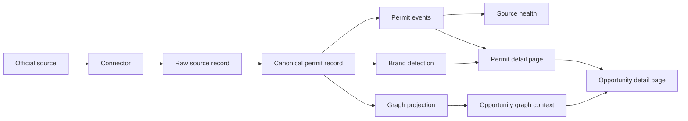
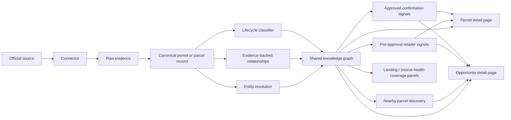
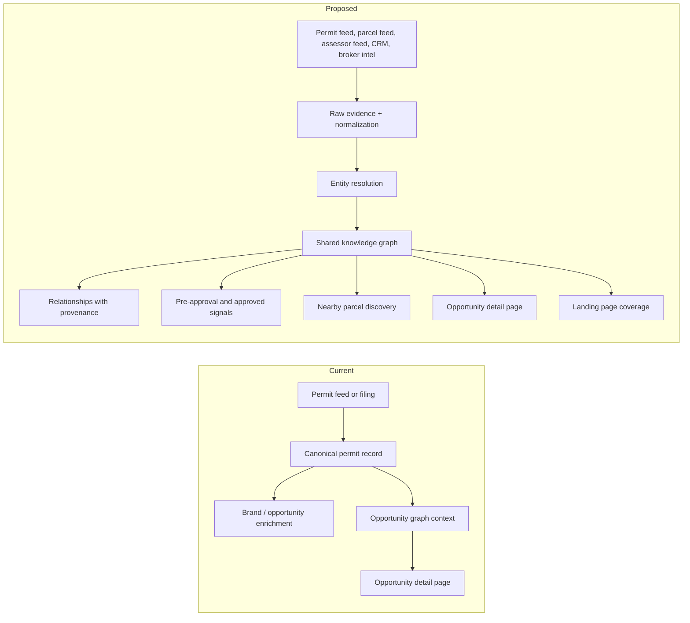

# Permit Ingestion Architecture

## Current Flow

In the current product, the graph context already shows up on the opportunity
detail page, permit detail now exposes source evidence and lifecycle events,
and the source-health view opens into individual filings for troubleshooting.
The current flow is still mostly record-centric: each source lands as a permit
or signal first, then downstream jobs enrich it.

## Proposed Direction

## What Changes

The current system already preserves source evidence, permit lifecycle state,
brand matches, and opportunity graph context. The proposed path makes the graph
layer the shared backbone for permits, parcels, organizations, and prospects so
new jurisdictions can be onboarded without teaching each one custom permit
logic.

That means:

- keep raw evidence attached to every relationship
- resolve duplicate entities through names, addresses, source ids, and aliases
- classify pre-approval and approved records separately
- attach nearby parcels and buyer lenses as reusable graph context
- surface the same evidence-backed context on the opportunity and permit detail pages

## Where It Lands In The App

The current landing surface already points into this workflow:

- The dashboard is the first stop and surfaces pre-approval and approved retail
  queues, graph coverage, nearby parcel coverage, and source-health status.
- The opportunity detail page is the working surface and now embeds retail
  permit signals, nearby parcel context, and the graph context panel together.
- The graph context panel can jump back into parcel review, so the same
  evidence-backed entities flow from the dashboard into the opportunity page
  without a separate navigation layer.

## Current Versus Proposed

## Scaling Tradeoffs

- Start with graph writes that are cheap and deterministic.
- Add richer entity resolution only when the source quality supports it.
- Keep permit-specific rules in source adapters or classifiers, not in the graph
  layer itself.
- Prefer a narrow set of high-confidence relationships over a noisy universal
  graph.

## Freshness Contract

Every production permit source declares a positive `freshness_sla_hours`. A
source with a publisher timestamp also classifies that field as one of:

- `record_updated_at`: the publisher says an individual record changed
- `dataset_refreshed_at`: the publisher says the dataset or extract refreshed
- `filing_event_at`: the timestamp is a filing, opening, or publication event

Sources without a trustworthy publisher timestamp use collection time for
operational health and report `ingestion_observed_at` through the health API.
Only record-update and dataset-refresh clocks can degrade source health. Filing
events remain visible as activity context, because a quiet jurisdiction is not
necessarily a broken source. The API retains `source_watermark_at` and
`source_lag_hours` for compatibility,
but also returns `freshness_semantics`, `freshness_label`, and the effective SLA
so operators can interpret those values correctly. Evidence panels call the
immutable raw-row timestamp `Snapshot captured`; it is not presented as proof
that the publisher re-observed an unchanged record.

This contract deliberately stays in source configuration rather than the graph
layer. Graph relationships consume evidence timestamps but do not infer what a
publisher's field means.
