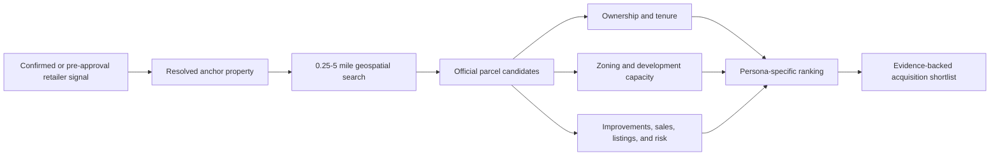

# Nearby Parcel Discovery - Phase 2

## Phase 2a Implementation

The first production slice is implemented around a confirmed, geocoded retailer
signal:

- canonical parcel records and independently versioned parcel facts
- physical-parcel grouping for condo units and multi-account assessor records
- persisted search inputs and ranked candidate snapshots
- 0.25-5 mile validation, SQLite haversine retrieval, and PostgreSQL PostGIS
  `ST_DWithin`/`ST_Distance` queries with a generated geography centroid and
  GiST index
- explainable `developer-v1` ranking with missing-data confidence penalties
- developer, investor, broker, and realtor buyer lenses with versioned
  explainable rankings; `investor-v1`, `broker-v2`, and `realtor-v2` add
  official sale-tenure evidence while
  never inferring listing status or owner willingness to sell
- shortlist and dismissal review with audit history
- opportunity-detail panel with confirmed-signal selection and bounded radius
- server-authorized CSV export with source-policy filtering, actor audit, and
  spreadsheet-injection protection

NYC PLUTO, Denver Assessor, Washington DC owner polygons, Florida FDOR
statewide cadastral parcels, Maryland iMAP / SDAT parcel points, and MassGIS
Level 3 property tax parcels are admitted production parcel sources. Parcel
boundaries, map interaction, assignment, policy-controlled export, and explicit
promotion into a standalone opportunity are implemented.

Parcel and assessor sources now use the same connector registry and bounded
runner as permits by declaring `record_type: parcel`. Declarative mappings
normalize parcel identity, centroid, site characteristics, values, zoning,
ownership, sale, tax, and vacancy fields. Raw rows remain immutable; ownership,
sale, tax, vacancy, zoning, land-use, improvement, and valuation facts are
versioned with source URLs and independent verification timestamps. Complete
replacement snapshots close managed facts that disappear; incremental rows do
not infer deletion from an omitted field.
Full-snapshot sources inherit the empty-snapshot and maximum-retirement circuit
breakers, so missing parcels retire only after a complete reconciled run and
reactivate without losing evidence if they reappear.

Polygon ArcGIS sources may set `include_centroid: true`; the connector requests
and preserves the publisher-computed centroid alongside optional boundary
geometry. Declarative `object_path` mappings then map `centroid.y` to latitude
and `centroid.x` to longitude without jurisdiction-specific parsing.

Unmapped source geometry is stored on `parcel_records.attributes` and exposed
to the API as derived `boundary_geometry` for map display. Sources fall into two
map modes:

- **Centroid only** — point geometry or no polygon in the admitted feed (for
  example Cook County current-year context, Maryland SDAT points). Maps plot
  the verified centroid marker only.
- **Centroid plus boundary** — polygon geometry retained in ingestion (for
  example Delaware FirstMap, MassGIS Level 3, SanGIS, Louisville LOJIC).
  Parcel detail and nearby-parcel search maps draw the footprint when
  `boundary_geometry` is present.

Raw polygon export remains blocked by each source's `export_policy`; UI shapes
are derived display context only.

Candidate CSV export is a separate server-side decision available to editors
and administrators. Only active sources whose exact policy value appears in the
reviewed parcel-export allowlist are included; missing, malformed, or newly
invented policy strings fail closed. Parcel-ID-only and situs-only policies
suppress broader columns, and ownership plus raw geometry are never included.
Every attempt logs the actor and request ID. Successful exports also retain the
candidate IDs, source-policy snapshot, exported/omitted counts, approved
columns, and a SHA-256 content digest; denied attempts retain their decision
reason and policy snapshot for incident reconstruction.

Canonical assessor parcels are also projected into the knowledge graph and
linked to their source records. Current ownership facts create `owned_by`
relationships with the raw assessor row as evidence; those relationships expire
when a parcel leaves a reconciled snapshot and reactivate on reappearance.

## Objective

Turn a geocoded Build Signal property or pre-approval retailer signal into a
bounded acquisition search for parcels that developers, investors, brokers, and
real estate operators may want to buy. Proximity is a discovery feature only.
It must never increase retailer identity confidence or imply that a nearby
parcel is controlled by the detected brand.

## Search Contract

- Anchor: a resolved property or parcel with a verified centroid, or a
  geocoded pre-approval / confirmed retailer signal linked to the opportunity.
- Default radius: 2 miles.
- User-selectable radius: 0.25 to 5 miles; the API rejects larger values.
- Geography: WGS84 coordinates with geodesic distance calculations.
- Result: parcel candidates ordered by a selected buyer persona and backed by
  source evidence, confidence, observation time, and data-license metadata.
- Freshness: ownership, zoning, sale, listing, and improvement facts retain
  independent source dates rather than sharing one parcel-level timestamp.

## Minimal Scalable Schema

### Parcel Records

One organization-scoped canonical parcel per official assessor identity:

- `source_system`, `external_parcel_id`, county/state jurisdiction
- optional `parcel_group_id` for tax accounts sharing one physical footprint
- situs address and normalized address
- centroid latitude/longitude
- parcel boundary geometry when licensed and available
- land area, improvement area/value, land value, total assessed value
- current land use and zoning code
- first seen, last seen, last verified, and active/retired state

PostgreSQL should use PostGIS `geography(Point, 4326)` for centroids and
`geometry(MultiPolygon, 4326)` for boundaries with GiST indexes. SQLite tests
can use latitude/longitude plus deterministic distance helpers; production
distance queries must use `ST_DWithin` and `ST_Distance`.

### Parcel Facts And Evidence

Version facts separately so corrections do not erase history:

- ownership snapshots and mailing address
- deed/sale events and consideration
- zoning and overlay observations
- building/improvement observations
- listings and broker evidence
- environmental, flood, access, and entitlement constraints
- immutable raw source record, source URL, excerpt or field path, confidence,
  observed timestamp, and last verified timestamp

### Searches And Candidates

Persist the user decision surface, not the raw geospatial result alone:

- search anchor, radius, persona, filters, and as-of timestamp
- candidate parcel, distance, overall score, feature scores, exclusions, and
  detector/ranker version
- review state: `candidate`, `shortlisted`, `dismissed`, `contacted`
- evidence references used by every scored feature

## Ranking Personas

All scores are explainable 0-100 feature composites. Missing data lowers
confidence and is never silently treated as a favorable value.

### Developer

- zoning capacity and allowed use
- parcel size, shape, frontage, and access
- low improvement-to-land-value ratio
- assemblage potential with adjacent parcels or common ownership
- ownership tenure and absence of recent major improvements
- distance to the anchor signal and complementary development context
- penalties for flood, environmental, landmark, access, and entitlement risk

### Investor Or Principal Buyer

- assessed value and recent sale basis
- ownership tenure and entity concentration
- income-property use compatibility
- nearby demand signal density
- redevelopment optionality and downside constraints

### Broker Or Realtor

- evidence completeness for owner outreach and pricing research
- stale or withdrawn listings
- absentee/corporate ownership and mailing-distance indicators
- official long-hold evidence, succession indicators when lawfully available, and recent
  outreach history
- estimated deal size and likely buyer-persona fit

Long tenure is an outreach-prioritization feature, not evidence of sale intent.
The UI and API always preserve that caution with the candidate explanation.

Sensitive personal data is not required for ranking. The system should favor
entity-level ownership and official property facts and apply jurisdictional
privacy and solicitation rules.

## Service Boundaries

- `parcel_ingestion`: assessor, cadastral, zoning, deed, and listing adapters.
- `parcel_resolution`: parcel identity, address normalization, boundary changes,
  splits, merges, and graph projection.
- `parcel_proximity`: radius validation and geospatial candidate retrieval.
- `parcel_ranking`: versioned persona feature calculation and explanations.
- `parcel_review`: shortlist, dismissal, assignment, export, and outreach state.

The generic knowledge graph links parcels, properties, owners, brokers, and
opportunities. Geospatial retrieval remains in the parcel service rather than
graph path traversal so distance queries use spatial indexes.

## Current Production Spines

- Cook County, IL now has a geometry/context-first spine through
  `cook_county_il_assessor_parcels_current_year_nearby`. It is designed for
  Chicago-area radius searches around permit and retailer signals, using
  current-year parcel identity, centroids, ZIP, municipality, community area,
  economic-district flags, flood/noise signals, TIF, and walkability context.
- This source deliberately excludes address, owner, value, sale, deed, and raw
  parcel-export fields. Those fields should be admitted later through separate
  reviewed Cook County address/value joins by `pin` + `year`, preserving source
  evidence and independent freshness instead of hiding a cross-dataset join
  inside the generic ingestion adapter.

## API Shape

- `POST /deals/{deal_id}/nearby-parcel-searches`
- `GET /deals/{deal_id}/nearby-parcel-searches`
- `GET /nearby-parcel-searches/{search_id}`
- `POST /nearby-parcel-searches/{search_id}/export`
- `PATCH /parcel-candidates/{candidate_id}`
- `GET /acquisition-radar`

Search input includes `radius_miles`, persona, minimum parcel area, land-use or
zoning filters, ownership filters, and result limit. Responses include distance,
score confidence, top reasons, cautions, source freshness, and map geometry.

## UI

The opportunity page currently includes a `Nearby Parcels` panel with bounded
radius, buyer lens, evidence freshness, and shortlist/dismiss actions. The
panel can start from a geocoded pre-approval retailer signal or a confirmed
signal, and confirmed opportunity creation now seeds the same parcel context
automatically for linked deals. The implemented workspace includes:

- map and synchronized sortable result table
- radius control capped at 5 miles
- persona segmented control
- zoning, size, ownership-tenure, and improvement filters
- score explanation and source evidence drawer
- shortlist/dismiss actions and broker/developer export

The organization-wide Acquisition Radar deduplicates these candidates across
opportunities and ranks them by parcel fit, evidence confidence, connected
signal confidence, repeated opportunity exposure, review state, and freshness.

No parcel becomes an opportunity automatically. Promotion is an explicit user
action that preserves the originating search, ranking version, and evidence.

## Phase 2 Definition Of Done

1. An operator can run a 0.25-5 mile search from a confirmed signal property or
   a geocoded pre-approval retailer signal linked to the opportunity.
2. Results use official parcel identities and spatially indexed distance.
3. Every candidate shows explainable developer, investor, or broker relevance.
4. Ownership, zoning, improvement, and transaction facts retain provenance and
   independent freshness.
5. Parcel splits, merges, corrections, and stale facts are versioned.
6. Users can shortlist, dismiss, assign, export, and promote candidates without
   changing retailer-signal confidence.
7. Tenant isolation, source licensing, privacy controls, replay, and geospatial
   performance are covered by automated tests.
