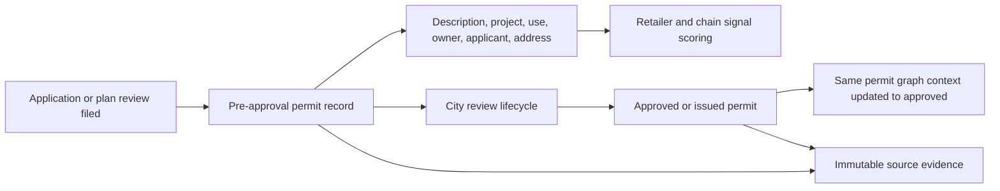

# Nationwide Permit Ingestion

## Scope

Permit coverage is managed by issuing jurisdiction, not by state. The source
registry is the coverage control plane: one row describes one official feed,
its jurisdiction, connector, schedule, cursor, field mapping, license notes,
and current health. Multiple sources can cover the same jurisdiction without
collapsing their provenance.

The state-by-state rollout and legal or lifecycle holds are tracked in
[`nationwide_source_coverage.md`](nationwide_source_coverage.md).
The current-vs-proposed ingestion diagram lives in
[`ingestion_architecture.md`](ingestion_architecture.md).
High-value official feeds that are researched but not yet admissible in
production are tracked in
[`app/services/ingestion/candidate_catalog.json`](../app/services/ingestion/candidate_catalog.json).
That queue is reserved for operational retries and legal, technical, or
freshness holds; a source is promoted into the production catalog only after
its blocker is cleared.

The checked-in catalogs now provide an explicit source decision for all 50
states: 39 states have at least one production source, while Alaska, Georgia,
Hawaii, Idaho, Iowa, Mississippi, Montana, New Mexico, Oklahoma, West Virginia,
and Wyoming are represented only by official-source candidates with documented
legal, technical, freshness, identity, or lifecycle blockers. This is
nationwide research coverage, not nationwide live ingestion. Candidate-only
states must remain visibly separate from production coverage in APIs and
dashboards.

## Pipeline

1. A connector fetches a page from an official source using a saved cursor.
2. The response is written to the raw-record store before transformation.
3. A source-specific field mapping produces a canonical permit record.
4. The canonical record is upserted by source and source record identifier.
5. Material changes append a permit event rather than overwriting history.
6. Entity resolution links the permit to properties, parcels, organizations,
   professionals, and opportunities with the raw record as graph evidence.
7. The ingestion run records counts, errors, cursor progress, and freshness.

Raw records are immutable. A repeated payload with the same content hash is a
no-op; a corrected payload is stored as a new version and can be replayed.

## Connector Contract

Connectors do transport work only. They receive source configuration and a
checkpoint, then return records, a next checkpoint, and whether more pages are
available. They do not know about permits, database models, or graph entities.

Initial connector families:

- Socrata SODA datasets, paginated with stable ordering and offset/checkpoint.
- ArcGIS FeatureServer layers, paginated by object ID/result offset.
- CKAN DataStore resources, paginated by stable sort and result offset.
- CSV over HTTPS or an uploaded/local file, streamed in bounded batches.
- JSON-array civic endpoints, sliced into bounded local pages after a full
  official array fetch.
- OpenDataSoft API v2 records endpoints, paginated with `limit`/`offset` and
  flattened from `record.fields` while preserving record ID, timestamp, and
  self URL for provenance.

## First Live Source Cohort

The checked-in source catalog contains official municipal permit feeds for
early-warning and confirmation coverage plus official parcel/assessor feeds
used by nearby acquisition discovery. Current permit feeds include:

- Austin Issued Construction Permits (`3syk-w9eu`)
- Austin Plan Review Cases (`n8ck-xkda`)
- Seattle Building Permits, including in-progress applications (`76t5-zqzr`)
- Seattle SDCI Land Use Permits (`ht3q-kdvx`)
- Seattle Street Use Permit Public Notices (`eyde-ia6x`)
- Washington Ecology SEPA Register (`mmcb-z6jf`)
- Washington State LCB Local Authority Letters (`vgcw-qfjm`) for statewide
  liquor, restaurant, grocery, hospitality, and cannabis pre-opening signals
- Everett Planning Application Notices for pre-approval land-use and planning
  activity published through the city's official RSS feed
- Pierce County PALS Permits (`Permits_Pierce_County/FeatureServer/0`)
- Bellingham Non-Residential Building Permits (`Permits/MapServer/0`)
- Chicago Building Permits (`ydr8-5enu`)
- NYC DOB NOW Approved Permits (`rbx6-tga4`)
- NYC DOB NOW Job Application Filings (`w9ak-ipjd`)
- Austin Site Plan Cases (`mavg-96ck`)
- NYC legacy DOB Job Application Filings (`ic3t-wcy2`)
- NYC DOHMH Restaurant Permit Applicants (`43nn-pn8j`) for pre-inspection
  restaurant/chain opening signals
- New York State SLA Pending Licenses (`f8i8-k2gm`) for pending restaurant,
  grocery, liquor, hotel/bar, and hospitality opening signals
- Buffalo Planning, Zoning, and Historic Preservation Approvals (`ybhc-xhg4`)
- Hartford Commercial Building Permits Lifecycle
  (`HartfordOpenDataTables/FeatureServer/0`)
- Washington DC DOB Building Permits 2026 (`FEEDS/DCRA/FeatureServer/18`)
- Washington DC Basic Business Licenses (`FEEDS/DCRA/FeatureServer/0`) for
  active restaurant, grocery, food, hotel, fuel, and service-retail opening
  signals
- New Orleans Permits - BLDS (`72f9-bi28`)
- East Baton Rouge Building Permits (`7fq7-8j7r`)
- San Francisco Building Permits, filtered to the publisher's primary-address
  flag (`i98e-djp9`)
- San Francisco Planning Department Non-Project Records (`y673-d69b`)
- Marin County Commercial Building Permits (`mkbn-caye`)
- San Jose Planning Permit Applications (`PLN_Geocortex_Public_PRD/MapServer/153`)
- Boulder Construction Permits (`Construction_Permits/FeatureServer/0`)
- Somerville Building Permit Applications (`nneb-s3f7`)
- Boston Article 80 Development Projects (`A80_project_points_all/FeatureServer/0`)
- Sacramento Commercial Building Permits Applied Current Year
  (`BldgPermitApplied_CurrentYear/FeatureServer/0`)
- Nashville Planning Development Applications
  (`Planning_Department_Development_Tracker_Applications/FeatureServer/0`)
- Raleigh Development Plans (`Development_Plans/FeatureServer/0`)
- Charlotte Rezoning Petitions (`PLN/Rezonings/MapServer/0`)
- New Hanover County Commercial Site Plans (`EnergovPermitsPlans/MapServer/1`)
- Wake County Commercial Building Permits (`Building_Permits/MapServer/0`)
- Greensboro Commercial Building Permits (`BuildingPermits_MS/MapServer/6`)
- Madison Current Planning Projects (`Current_Planning_Projects/MapServer/0`)
- Orlando Permit Applications (`ryhf-m453`)
- Mesa Commercial Permit Submittals (`kg7m-y6f3`)
- Tempe Building Permits Commercial Context (`building_permits/FeatureServer/0`)
- Cleveland Building Permit Applications (`Building_Permit_Application_Tasks/FeatureServer/0`)
- Cincinnati Building Permits (`uhjb-xac9`)
- Portland Development and Building Applications (`Public/BDS_Permit/FeatureServer/22`)
- Pittsburgh Issued Building Permits (`f4d1177a-f597-4c32-8cbf-7885f56253f6`)
- Texas Comptroller Sales Tax Locations (`3kx8-uryv`)
- Montgomery County Commercial Permits (`7ate-xrxm`)
- Henderson Commercial Development Permits (`public/OpenDevPermits/MapServer/2`)
- Denver Commercial Construction Permits (`OpenDataCatalog/MapServer/6`)
- Detroit BSEED Building Permits (`bseed_building_permits`) as an approved-only
  confirmation source with same-day permit lifecycle, project, valuation, and
  parcel context.
- Detroit BSEED Building Permit Plan Reviews
  (`bseed_building_permit_plan_reviews`) as a canary-validated candidate for
  accepted, routed-for-review, and plans-approved filings before issuance. Its
  shared `record_id` connects early review evidence to the issued source.
- Bend Planning Applications, Permit Applications Point, and Permit
  Applications Line for nightly planning and permit lifecycle coverage with
  pre-approval, approved, tax-lot, owner, valuation, use, and address context.

The structured candidate queue currently tracks:

- Orlando Planning Applications (`bhxy-4rji`) as a `legal_hold` planning and
  retailer-movement source with strong pre-approval value but no affirmative
  commercial reuse grant yet.
- Atlanta Building Permit Tracker (`Building_Permit_Tracker/FeatureServer/2`)
  as a `legal_hold` permit tracker with current pre-approval, issued, and
  closeout statuses, but unresolved tracker and archive rights for commercial
  reuse and redistribution.
- Phoenix Plan Review And Permits (`Public/Planning_Permit/MapServer`) as a
  `legal_hold` planning and permit source with strong pre-approval zoning and
  review context, but blank license metadata and a non-commercial download
  posture that still need written clearance.
- Huntsville Issued Building Permits (`Licenses/BuildingPermits/MapServer/0`)
  as a `legal_hold` approved-only confirmation layer with strong commercial
  metadata, but restricted/blank rights metadata that still needs written
  clearance before customer-facing use.
- Birmingham Digital Plan Room (`city-birmingham-digital-plan-room`) as a
  `legal_hold` portal hold for pre-approval permit and plan-review activity
  with no verified bulk/API export or commercial reuse grant yet.
- Mobile Build Mobile Portal (`buildmobile.org`) as a `legal_hold` portal hold
  for planning, permitting, and predevelopment workflows without a documented
  bulk/API feed or clear commercial reuse grant.
- Evansville Building Commission Permits (`BC/BUILDING_COMMISSION_PERMITS/MapServer/0`)
  as an `legal_hold` Indiana hold with application-status and project/use
  detail, but backend query failures and missing commercial reuse terms still
  block production admission.

Only `operational_retry` candidates with an explicit `probe_settings` object
and `probe_field_mappings` are runnable. That probe path uses the same
connector and normalization canary logic as live sources, but it never writes
raw records, permit records, graph relationships, or retailer candidates. The
entry point is `POST /ingestion/candidates/{candidate_key}/canary`, and the
Source Health page exposes the same action as a "Retry canary" button for
admins. Each run is persisted as a candidate canary attempt, and the candidate
queue shows the latest outcome inline so retry health is visible without
opening a separate run log. This gives us a repeatable retry loop for public
endpoints that are temporarily unstable while keeping the production catalog
clean.

Austin remains the reference market for multi-source development intelligence:
issued construction permits confirm downstream activity, plan-review rows cover
commercial building review, and site-plan cases provide a retailer/chain
early-warning slice. The site-plan source is restricted to recent actionable
statuses, explicitly selects only admitted public fields, suppresses
applicant/owner phone and mailing fields, and maps applicant/owner
organizations into party context so project names such as restaurants, auto
parts stores, coffee shops, and shopping centers can become evidence-backed
brand candidates before issuance.

Operators can now move from the Source Health page into a permit detail page
for any returned filing, where the raw permit history, brand matches, and graph
relationships are shown together. That keeps troubleshooting focused on a
single filing instead of forcing a switch between run history, review queues,
and graph screens.

Brand candidates expose a signal-quality label in the review API/UI. Applicant
or establishment-name hits, such as NYC restaurant permit-applicant DBAs, are
tagged as stronger `Applicant DBA` signals; construction narrative hits, such
as LA work descriptions, remain `Description context` candidates that require
human review before promotion.

The same review surface now carries approved-opening retailer signals as well
as pre-approval signals. That lets the dashboard show both early chain motion
and official openings without splitting the user into separate workflows.
Approved-only confirmation sources such as Detroit BSEED remain distinct from
their pre-approval companions, while shared source identities connect the
lifecycle. Retailer-opening feeds like Texas Comptroller sales tax locations
and Washington DC business licenses remain exposed as live opening coverage in
the operations UI.
San Francisco Planning Department non-project records add entitlement and
review context before or alongside building permits. The narrow production
slice keeps planning record types such as conditional use and discretionary
review, suppresses applicant personal names and planner names, and uses PIM
links as evidence. Live July 2026 records included submitted Starbucks
conditional-use and discretionary-review records for extended operating hours.
Marin County commercial building permits add a clean received-to-issued
county-market lifecycle under ODbL terms. `received_date` rows without
`issued_date` are pre-approval evidence, while populated `issued_date` rows are
approved confirmation. The first slice keeps commercial address, parcel,
description, work/fee context, contractor name, valuation, and coordinates,
while suppressing contractor address/license and raw source replacement export.
Tempe building permits add a CC BY 4.0 Arizona commercial/tenant-work context
source from the city's official ArcGIS layer. The production slice uses
`StatusDateDtm` recency, filters to commercial, tenant-improvement, restaurant,
retail, office, hotel, market/food, medical, and other high-signal development
text, and suppresses contractor phone/email/contact fields. `Applied`,
`Ready for Issuance`, and `Ready to Issue` rows remain pre-approval evidence;
issued, CofO/TCO, final, finaled, and closed rows are approved confirmation.
The July 18, 2026 live canary fetched 35 valid rows with 8 pre-approval and
27 approved records observed.
- Denver Residential Construction Permits (`OpenDataCatalog/MapServer/5`)
- Denver Demolition Permits (`OpenDataCatalog/MapServer/7`)
- San Diego Development Permit Approvals 2026
  (`approvals_created_2026_datasd.csv`)
- Milwaukee Commercial Permit Work Data
  (`828e9630-d7cb-42e4-960e-964eae916397`)
- Minneapolis Commercial Construction Code Permits
  (`CCS_Permits/FeatureServer/0`)
- St. Louis Commercial Occupancy Applications
  (`GetCommercialOccupancyInspections`)
- Louisville / Jefferson County Active Construction Permits
  (`active_construction_permits/FeatureServer/0`)
- Vermont Act 250 Large Development Context
  (`OPENDATA_ANR_ENVIRON_SP_NOCACHE_v2/MapServer/166`)
- Montgomery Alabama Commercial Construction Permits
  (`Construction_Permits/FeatureServer/0`)
- Fayetteville Arkansas Permit Lifecycle
  (`Permits/MapServer/0`)
- Fort Worth CIVIC Commercial Permits
  (`CIVIC/Permits/FeatureServer/0`)
- Charleston Active Commercial Permits
  (`External/Applications/MapServer/20`)
- Charleston TRC Development Plans
  (`External/Applications/MapServer/757`)
- Provo Building Permit Applications
  (`DevServ/CurrentProjects/MapServer/1`)
- Provo Planning Applications
  (`DevServ/CurrentProjects/MapServer/0`)
- Maine DEP Land Applications and Permits
  (`dep/Land_Licensing/MapServer/6`)
- Bismarck Development Activities
  (`Planning_Activities_Join/FeatureServer/0`)
- Lincoln / Lancaster Development Applications
  (`Planning/DevRevAPPLICATIONS/MapServer/1`)

The parcel cohort currently includes NYC PLUTO (`64uk-42ks`), Denver
Assessment Division parcels (`ODC_PROP_PARCELS_A/FeatureServer/245`),
Colorado statewide public parcels
(`Colorado_Public_Parcels/FeatureServer/0`),
New Jersey NJGIN statewide parcels (`Framework/Cadastral/MapServer/0`),
Allegheny County parcel boundaries (`OPENDATA/Parcels/MapServer/0`),
Allegheny County property assessments (`65855e14-549e-4992-b5be-d629afc676fa`)
for monthly CC0 parcel/value/sale enrichment,
Washington DC owner polygons (`Property_and_Land_WebMercator/FeatureServer/40`),
Florida FDOR statewide cadastral parcels (`Florida_Statewide_Cadastral/FeatureServer/0`),
Maryland iMAP SDAT parcel points (`MD_PropertyData/MapServer/0`),
MassGIS Level 3 property tax parcels (`Massachusetts_Property_Tax_Parcels/FeatureServer/0`),
Miami-Dade Property Appraiser property/sales (`MD_ComparableSales/MapServer/5`),
Orange County Property Appraiser polygons (`DynamicForJs/PARCEL/MapServer/1`),
Hillsborough, Duval, Broward, Polk, Wake County, San Diego SanGIS
geometry/situs, Louisville/Jefferson County LOJIC, Vermont VCGI statewide
parcels, Rhode Island statewide tax parcels, New Hampshire DRA / NH GRANIT
parcel mosaic, Montgomery Alabama parcels, Indianapolis/Marion County,
Arkansas statewide cadastral parcels, Collin County Texas parcels, Hennepin
County, Tennessee Comptroller IMPACT parcels, Greenville County South Carolina
parcels, Sedgwick County Kansas parcels, Utah County UGRC parcels, City of St. Louis
parcels, Sioux Falls / Minnehaha parcels, Cass County North Dakota
parcels, plus Maine GeoLibrary organized-town parcels. Parcel records use the same
connector, evidence, run-health, checkpoint, and snapshot infrastructure while
normalizing into their own domain-neutral parcel contract.

Vermont VCGI is admitted only for value-added nearby-parcel discovery and
scored context. Raw statewide parcel resale, bulk replacement export, and
non-value-added redistribution stay blocked by catalog export policy.
Rhode Island statewide tax parcels follow the same derived-context pattern,
but exclude owner, situs address, assessed value, and sale evidence because
those facts are not admitted from the statewide layer.
New Hampshire DRA / NH GRANIT parcels are likewise admitted only for derived
nearby-parcel discovery and exclude city owner/value/sale enrichment until
source-specific rights are confirmed.
Montgomery Alabama parcels follow the local derived-context pattern and exclude
owner, mailing, valuation, and deed/sale fields pending broader written rights.
Arkansas statewide cadastral parcels are admitted for centroid-driven nearby
discovery and exclude owner, valuation, legal description, CAMA key, and
county-local sale/deed details.
Collin County parcels are admitted for Plano/Frisco nearby discovery in the
first slice with owner, valuation, deed, legal-description, and improvement
detail fields suppressed pending UX/privacy review.
Tennessee Comptroller IMPACT parcels are admitted only for state-maintained
counties; Davidson, Hamilton, Knox, Montgomery, Rutherford, Shelby, Williamson,
Chester, and Hickman need local-source authorization before production use.
Greenville County South Carolina parcels are admitted for derived nearby-parcel
context only, with owner, mailing, value, tax, sale, deed, raw county extract,
and bulk geometry export fields suppressed.
Sedgwick County Kansas parcels are admitted for derived nearby-parcel context
only. The production slice uses parcel identity, acreage/area, currentness, and
geometry-derived proximity, while owner, situs/mailing address lists, assessed
value, sale, legal-description, raw extract, and bulk geometry export fields
remain suppressed.
Utah County UGRC basic parcels are admitted for derived nearby-parcel context
with State of Utah/SGID attribution. The first production slice stores parcel
identity, situs address, generalized ownership type, currentness, source URL,
and geometry-derived proximity while suppressing owner names, mailing addresses,
sales, paid county assessor extracts, and raw bulk parcel exports.
Maine GeoLibrary organized-town parcels are admitted for recency-gated derived
nearby-parcel context with Maine GeoLibrary/MaineIT GIS attribution. The
production slice stores parcel identity, town/county, property location, update
date, parcel type, and geometry-derived proximity while suppressing owner table
joins, raw parcel extracts, bulk geometry exports, and assessor resale products.
Sioux Falls / Minnehaha parcels are admitted for derived nearby-parcel context
with City of Sioux Falls CC BY 4.0 attribution. The production slice stores
parcel identity, situs address, county, acreage, land-use/activity, owner and
mailing context, public dates, and geometry-derived proximity while suppressing
legal descriptions, sale evidence, and raw parcel/geometry resale.
Cass County North Dakota parcels are admitted for derived nearby-parcel context
around Fargo and West Fargo with Cass County GIS attribution. The first slice
stores stable parcel identity, situs address, jurisdiction, school/district
context, acreage, commercial/residential class, and geometry-derived proximity
while suppressing owner mailing fields, legal descriptions, assessed values,
sale evidence, and raw parcel/geometry resale.
Maryland iMAP / SDAT parcel points are admitted as a statewide derived
nearby-parcel spine under Public Domain terms. The production slice stores
composite county/account identity, situs, mailing-address context, zoning/use,
building area, assessment values, sale-date/consideration evidence, official
SDAT links, and point geometry while excluding owner names that require a
separate license agreement and suppressing legal, deed, plat, and raw
source-replacement export fields.
MassGIS Level 3 property tax parcels are admitted as a statewide
centroid-first nearby-parcel spine with requested Commonwealth/MassGIS
attribution. The production slice stores `GlobalID` row identity plus
town/parcel grouping, situs, owner-name context, assessment values,
land-use/zoning, sale date/price, and building area while suppressing owner
mailing, deed/book/page, survey/boundary, and raw polygon source-replacement
fields.
Delaware FirstMap statewide parcels are admitted for derived nearby-parcel
context with Department of Technology and Information / FirstMap attribution.
The production slice stores parcel PIN, county, acreage, update date, polygon
geometry, and server centroid for radius search while suppressing owner,
situs/mailing, valuation, sale/deed, zoning, legal-description, raw parcel
extract, and bulk geometry export fields.

Charleston active commercial permits and TRC development plans are admitted as
narrow pre-approval-through-approved signals. They are used for derived permit
and opportunity context with Charleston attribution, while raw-feed resale and
bulk source replacement exports remain blocked by catalog export policy.
Delaware DNREC stormwater NOI and septic permits are admitted as statewide
environmental-development/site-readiness signals. Stormwater NOI records expose
planned construction activity with received dates and active/closed statuses;
septic records expose application-received through approved/completed lifecycle
dates. Both preserve raw status and avoid overclaiming final building approval.
Virginia VGIN statewide parcels are admitted as a narrow parcel/proximity spine
for Phase 2 nearby-parcel discovery. They are not permit signals; they provide
parcel identity, locality, optional situs context, currentness, geometry, and
centroids while owner/mailing, assessor, sale, and raw export fields remain
suppressed.
Fairfax County DevelopmentTracker site records are admitted as a narrow
pre-approval-through-approved Virginia development feed. They use public PLUS
site records, parcel geometry, status dates, public record links, and
approved-plan links while suppressing inspector/editor/internal workflow fields.
Norfolk permit records are admitted from the city's Public Domain Socrata
dataset as a distinct permit-level slice. The first production query excludes
inspection rows to avoid duplicate permits and keeps pending zoning/business
license review records as pre-approval commercial activity signals.
Norfolk conditional-use permits are admitted as effective planning/use context,
not a full pending queue. They are valuable evidence for restaurant, ABC,
extended-hours, car-wash, and other use-specific approvals that can explain why
a chain or retailer is appearing at an address.
Virginia Beach building permit applications are admitted as a narrow table-based
permit feed with the city-required modified-source disclaimer. Lifecycle comes
from `Status`, not merely `IssueDate`, because some pending/pre-issuance rows
carry issue dates; GPIN/address are used for parcel linkage because the service
does not include geometry.
Lynchburg development-project locations are admitted as geocoded pre-approval
through approved context for site plans, rezonings, subdivisions, conditional
uses, design review, and related TRAKiT project classes. The spatial layer is
not complete because of join conflicts, so a future tabular reconciliation pass
should compare against `Development Projects - Tabular`.
Cary development applications are admitted from the Town of Cary's CC0
Developments layer as pre-approval-through-approved site/subdivision-plan
context. They are especially useful for retailer and chain discovery because
project names, summaries, use categories, square-footage scale, public record
links, and polygon geometry can appear while a plan is still `In Review` or
`Active`.
Cary building permit applications are admitted as a separate non-residential
BLDS-style application slice. These rows are not individual permits, but they
add permit/application status, applied/issued/completed dates, cost, square
footage, PIN, owner entity, contractor company, and point location that can
confirm or enrich the earlier development-plan signal. Contractor phone/address
and owner mailing fields are suppressed.
Raleigh development plans are admitted as pre-approval-through-approved
development-plan context from the city's official public-authoritative ArcGIS
layer. `Submitted - Online` and `In Review` rows remain early signals, while
approved rows stay available as confirmation. The source is especially useful
for chain detection because project names can expose named retail concepts such
as 7 Brew before a building permit is issued; parcel/owner context is linked
later through Wake County parcel and nearby-parcel enrichment.
Charlotte rezoning petitions are admitted as pre-approval-through-approved
planning context from Charlotte-Mecklenburg Planning's official rezoning GIS
layer. Pending petitions with no approved date remain early signals, while
petitions with an approved date become confirmation. The production slice keeps
petition number, petitioner, existing/requested zoning, type, acreage-derived
site scale, received/approved dates, status, public petition URL, proposed-use
text when present, and a derived polygon centroid. Staff/editor fields and raw
geometry exports are suppressed. This source is valuable because petitioner
names can reveal retailers, chains, developers, and land-use intent before
building permits or public opening announcements.
New Hanover County commercial site plans add Wilmington-area pre-approval
context from the county's official EnerGov Plans GIS layer. `In Review`
commercial site-plan rows are kept as pre-approval evidence, while `Approved`
and `Approved with Conditions` rows are approved confirmation. The slice keeps
plan number, applicant/owner organization names, public project text, zoning,
parcel ID, lifecycle dates, source coordinates, and evidence metadata; internal
assignment, fee, owner mailing, raw geometry, and raw source-replacement fields
remain suppressed.
Wake County commercial building permits are admitted as a CC BY 4.0
pre-approval-through-approved building-permit source that complements the
existing Wake parcel spine. The production slice keeps active commercial rows
with retailer, restaurant, tenant, business, mercantile, high-square-footage, or
high-valuation context; suppresses owner/permit mailing blocks; and preserves
Tyler EnerGov links as evidence. `Submitted`, online-submitted, incomplete,
in-review, on-hold, customer-action, and unissued approved rows remain
pre-approval; issued, complete, issue-date, and final-date rows are approved
confirmation. The July 18, 2026 live canary fetched 35 valid rows with 5
pre-approval and 30 approved records observed.
Greensboro commercial building permits are admitted as a narrow public-domain
open-data policy source from the city's official building-permit dashboard
ArcGIS layer. Commercial rows with active unissued permits remain pre-approval,
while issued dates, final CO dates, final CO flags, and issued statuses are
approved confirmation. The source keeps permit and plan-review numbers, status,
application/issue/final dates, commercial/work/use descriptions, contractor and
owner business text, address, valuation, square footage, zoning as raw evidence,
city address key, and WGS84 point geometry. Owner mailing/contact fields,
contractor contact fields, and raw source-replacement exports remain excluded.
The July 18, 2026 live canary fetched 35 valid rows with 11 pre-approval and 24
approved records observed.
Buffalo planning, zoning, and historic-preservation approvals are admitted from
the city's official Public Domain Socrata feed as positive development-review
context. `AppCond` rows map to pre-approval/conditional approval context and
`Approved` rows map to approved entitlement context. The dataset does not
publish denied or truly pending applications, so it should enrich parcel and
opportunity evidence but not be used to calculate full funnel conversion. The
July 18, 2026 live canary fetched 45 valid rows with 16 conditional/pre-
approval and 29 approved records observed.
Hartford commercial building permits are admitted from the official City of
Hartford CC0 ArcGIS table as commercial pre-approval-through-issued lifecycle
context. `Pending`, `In Review`, `Additional Info Required`, `Ready to Issue`,
and related review statuses remain pre-approval evidence; `Issued`, `TCO
Issued`, `Closed - Paid`, and `Closed - Approved` are confirmation. This feed
does not expose coordinates in the admitted table response, so property and
parcel joins should use address and `PARCEL_ID`. Daily health uses a
`DATE_OPENED DESC` freshness probe while production pagination remains stable on
`OBJECTID`.
Madison current planning projects are admitted as pre-approval-through-approved
planning context from the official Planning Division ArcGIS layer. Land Use and
Subdivision applications under review, active, in process, or referred remain
pre-approval evidence; final-approval and approved/final-review statuses remain
confirmation. The source keeps public project IDs, names, statuses, submitted
and circulated dates, requests, description, meeting text, address, parcel,
applicant organization, owner name, official project URL, Legistar evidence
links, and derived point geometry while suppressing planner/contact details,
owner mailing blocks, raw geometry export, and raw source-replacement export.
The July 18, 2026 live canary fetched 69 valid records with both pre-approval
and approved stages observed.
Miami-Dade WASD unincorporated permit/process records are admitted as a narrow
Florida commercial/use signal. The first slice focuses on active applied or
issued process records whose use text indicates retail, package store, office,
industrial, commercial, or restaurant activity. Legacy municipal session links
and raw source-replacement exports are suppressed; the official ArcGIS layer is
retained as the evidence source.
Orlando permit applications are admitted as a narrow commercial plan-review
slice from the city's daily official Socrata dataset. Lifecycle is derived from
milestone dates, not from the broad `Open` status, so unissued rows with
processed or under-review dates remain pre-approval evidence and rows with an
issue/final/CO/COC date become confirmation. Live July 2026 records included
unissued Publix projects, which makes this a strong chain-opening signal before
final permit issuance. Owner names, contractor phone/address, private-provider
fields, and raw source-replacement exports are suppressed.
Mesa commercial permit submittals are admitted as Accela workflow evidence for
commercial applications and resubmittals. Rows are workflow events, so the
source row number is canonical identity and the repeated permit record ID is
kept as application/permit identity for grouping. Live July 2026 examples
included in-review Dutch Bros submittals before approval. Staff/action names,
date bucket fields, and raw source-replacement exports are suppressed.
Florida DEP ERP applications are admitted as statewide environmental and
site-development context for commercial/development projects. Pending agency
actions are pre-approval signals; effective/exempt/default rows are approved
environmental context. This layer can reveal warehouses, restaurants, hotels,
subdivisions, and commercial redevelopment before or alongside municipal
building permits, but it must not be presented as a final building approval.
Maine DEP land applications are admitted as narrow statewide environmental and
site-development context. They are useful for project/applicant narrative and
approval timing, but they do not replace municipal building-permit feeds and
should be labeled as DEP evidence in downstream opportunity graph context.
Bismarck development activities are admitted as narrow planning and site-plan
context. They preserve submitted/staff-review/hearing/finalization status for
pre-approval detection, project/applicant/developer names, parcel/address,
dates, and geometry, while excluding fees, internal editor/audit fields, legal
descriptions, raw geometry exports, and source replacement resale.
Lincoln / Lancaster development applications are admitted as narrow
pre-approval-through-approved planning context from the official PATS workflow.
They preserve application number, subtype, status, project name/description,
submittal/effective dates, public decision references, and geometry-derived
location while suppressing raw shape metrics, raw geometry exports, and source
replacement resale. Nebraska assessor parcel layers remain rights holds until
commercial storage, customer display, API output, export, retention,
attribution, and suppression terms are confirmed in writing.

Seattle retains the original internal source key while its endpoint expands
from the issued-only view to the inclusive city dataset. This preserves source
identity and provenance for installations that already synchronized the first
catalog version.
Seattle SDCI Land Use Permits add non-residential and multifamily Master Use
Permit context for zoning, SEPA, design-review, subdivision, shoreline, and
development-site formation before downstream building permits are issued.
Seattle street-use public notices are admitted as a narrow SDOT public-comment
signal for curb, cafe, and street-use activity. They stay `pre_approval` unless
a future decision field is added, and they supplement rather than replace SDCI
building-permit lifecycle coverage.
Washington Ecology SEPA Register records are admitted as structured statewide
environmental pre-approval context with Ecology attribution. The production
slice stores register ID, SEPA number, proposal/project text, lead agency,
site address/city/parcel, published/issue dates, coordinates, and evidence URL,
while suppressing lead-agency contact details, applicant contact blocks, raw
document bodies, sensitive site locations, and raw document resale.
Pierce County PALS permits are admitted as restricted unincorporated-county
permit/development context with Pierce County attribution, no county
endorsement, source/disclaimer notices, and no raw bulk resale. They cover
building, development engineering, environmental, fire prevention, land use,
and sewer workflows with application/approval/issued/final dates, status,
parcel, address, valuation, square footage, project text, and point geometry.

Approved feeds remain the confirmation layer. Application and plan-review feeds
are the early-warning layer. Both normalize into the same permit record and
graph model with the city's exact status preserved alongside an
`approval_stage` of `pre_approval` or `approved`.

East Baton Rouge building permits are admitted as public-domain commercial
confirmation coverage from the parish open-data portal. The source is current
and party-rich, but the publisher describes it as issued construction and
occupancy permits, so every row is treated as approved evidence rather than
early warning. Contractor address, fee, lot/subdivision, and raw source export
fields are suppressed while permit identity, project text, owner, applicant,
contractor, valuation, square footage, issued/filed dates, address, and
coordinates are retained.

Texas Comptroller sales-tax locations are admitted as statewide approved-only
retailer-opening context. This is not a building or development permit source,
but it provides official Public Domain outlet evidence with taxpayer/location
identity, location name, address, NAICS, permit date, and first-sale date. A
future `first_sale_date` can be operationally useful for pre-opening chain
signals, while the normalized `approval_stage` remains `approved` because no
application/review stage is exposed. Taxpayer mailing fields, tax authority
IDs, raw taxpayer export, and raw source replacement exports are suppressed.

Vermont Act 250 is a narrow statewide large-development context feed rather
than canonical city permit coverage. Burlington's richer municipal zoning and
permit lifecycle remains held until a supported licensed bulk/API path is
available.



The filing context includes application and permit numbers, raw status,
application/status/approval dates, work class, review type, proposed use,
occupancy, project name, work description, valuation, floor area, owner,
applicant, contractor, address, parcel, and source link when published. This is
the text and party context used by the downstream brand-detection layer; a
brand should not be inferred from an owner or applicant name without evidence.

Chicago currently publishes issued permits in bulk but does not publish a
general pending-building-application bulk dataset. That jurisdiction remains
approved-only until a permissioned city integration or official data delivery
is available.

Catalog entries contain transport settings, stable ordering, license notes,
defaults, and declarative field mappings. Re-syncing is idempotent: mutable
configuration is updated while source identity, raw evidence, and run history
remain stable. Adapter and record-type changes are rejected because those alter
the meaning of an existing source.

The checked-in production catalog refuses entries without an official landing
page, reviewed license statement, and reconciliation mode. Technically useful
but unlicensed sources remain in the onboarding decision log, not in active
configuration.

Blocked candidates can be converted into a consistent agency-ready access
contract without touching the database:

```bash
python -m app.services.ingestion.cli catalog source-request \
  --candidate-key anchorage_ak_bsd_permit_lookup \
  --output docs/source_access_requests/anchorage_ak_bsd_permit_lookup.md
```

The contract requests supported delivery, historical and incremental coverage,
durable identity, lifecycle dates, deletion semantics, control totals, privacy
limits, and written rights for evidence-backed product use. The same generator
works for permit and parcel candidates so source outreach does not drift into
one-off jurisdiction requirements.

Catalog entries can also declare `suppressed_fields` when a source is admitted
only for a narrower evidence use, such as geometry/situs parcel context without
owner, value, or sale export. The catalog loader rejects any source that fetches
or maps a suppressed field, so rights and privacy exclusions are enforced before
the source can run.

When a catalog entry declares a `field_allowlist`, the loader also verifies
that explicit connector field selections stay inside that allowlist and that no
suppressed field is simultaneously allowlisted. Canary-required fields must
also be inside the allowlist, so operational checks cannot depend on unreviewed
or intentionally suppressed source fields. This keeps narrow-admission sources
from silently expanding beyond the reviewed public evidence contract as new
jurisdictions are onboarded.

Most feeds do not expose a uniformly trustworthy row-modified cursor. Backfills
therefore use stable identifier ordering, and the catalog marks those feeds for
periodic full reconciliation. San Francisco publishes `data_loaded_at` and a
unique `record_id`; that source uses a two-field keyset cursor for incremental
resume while retaining periodic reconciliation. The content hash keeps
unchanged rows a no-op while still capturing corrections, revocations, and
records whose status changed in place. Offset checkpoints are suitable for
bounded backfill batches, but they are not a substitute for reconciliation on
a changing public dataset.

New Orleans `permitnum` is not row-unique, so its source identity is Socrata
`:id`, explicitly requested with `$select=:*,*`. Its official `issuedate` is the
conservative approval boundary; rows without it remain available as
pre-approval signals, with the exact `statuscurrent` retained.

Boulder uses the city's unique `PermitID` GUID and ArcGIS offset pagination
ordered by that identifier. ArcGIS date values are normalized from Unix
milliseconds through a generic mapping transform. With no trustworthy
row-modified cursor, a daily full snapshot and content-hash reconciliation
capture status changes to older applications. `IssuedDate` is the conservative
approval boundary.

Somerville filters the city's broader applications dataset to building permits
and keys rows by publisher-designated `application_id`. It retains received,
review, approved/waiting, issued, denied, and withdrawn states while using
`issue_date` as the conservative approval boundary. The source is ODbL 1.0, so
its catalog configuration explicitly records attribution and database
share-alike review requirements.

Cleveland keys its application/task feed by unique `PERMIT_ID` and retains
pending as well as issued applications. The canonical row captures permit
type, plan/use context, work narrative, parcel, valuation, and contractor,
while the raw evidence preserves the service's structured task and status
history. The source is ODbL 1.0 and carries the same attribution and external
derived-database review flags as Somerville.

Large ArcGIS feeds can opt into generic keyset pagination. Cleveland advances
by the service's indexed `OBJECTID`, always querying `OBJECTID > last_seen`
with ascending order, while canonical identity and deduplication remain on
`PERMIT_ID`. This prevents inserts from shifting offset pages during a bounded
run without coupling the connector to Cleveland's permit semantics.

Portland scopes its 1.45-million-row all-permits layer to commercial and
residential buildings, site development, land-use review, development review,
and pre-application conferences. It keys canonical records by unique
`FOLDERKEY` and uses `OBJECTID` only for transport. A generic date-transform
tolerance quarantines implausible future lifecycle dates from canonical fields
without discarding their immutable raw evidence.

Pittsburgh exercises the generic CKAN DataStore connector. Its CC BY feed is
explicitly configured as `approved_only`, preserving the issued confirmation
layer without implying Pennsylvania early-warning coverage.

Montgomery County's public-domain commercial-permit feed is also explicitly
`approved_only`. It adds fresh Maryland confirmation evidence while leaving
the state's early-warning status unresolved.

Henderson adds a public-domain commercial-development feed with true pending
and issued stages. Canonical identity uses the layer's source UUID while
`OBJECTID` remains only a resumable transport key.

```bash
python -m app.services.ingestion.cli catalog sync --organization <id-or-slug> --dry-run
python -m app.services.ingestion.cli catalog sync --organization <id-or-slug>
python -m app.services.ingestion.cli brands sync --organization <id-or-slug>
python -m app.services.ingestion.cli brands backfill --organization <id-or-slug> \
  --dry-run --max-records 1000
python -m app.services.ingestion.cli brands backfill --organization <id-or-slug> \
  --batch-size 500
python -m app.services.ingestion.cli canary --organization <id-or-slug> \
  --source-key austin_tx_site_plan_cases --sample-size 10
python -m app.services.ingestion.cli canary --organization <id-or-slug> \
  --all --sample-size 10
INGESTION_ORGANIZATION=<id-or-slug> INGESTION_ROLLOUT_WAVE=1 \
  ./scripts/wave-canary-readiness.sh
python -m app.services.ingestion.cli health --organization <id-or-slug>
python -m app.services.ingestion.cli health --organization <id-or-slug> \
  --source-key washington_state_lcb_local_authority_letters \
  --source-key everett_wa_planning_application_notices
python -m app.services.ingestion.cli run --organization <id-or-slug> \
  --source-key austin_tx_issued_construction_permits --max-pages 1
python -m app.services.ingestion.cli run --organization <id-or-slug> \
  --source-key austin_tx_issued_construction_permits --max-pages 10 --resume-latest
python -m app.services.ingestion.cli run-all --organization <id-or-slug> \
  --max-pages-per-source 10
python -m app.services.ingestion.cli run-all --organization <id-or-slug> \
  --stage pre_approval_and_approved --max-pages-per-source 100 --reset-checkpoints
python -m app.services.ingestion.cli scheduled --organization <id-or-slug> \
  --source-key washington_state_lcb_local_authority_letters \
  --source-key everett_wa_planning_application_notices \
  --max-pages-per-source 10
python -m app.services.ingestion.cli scheduled-due --organization <id-or-slug> \
  --as-of 2026-08-11T12:00:00+00:00 --plan-only
python -m app.services.ingestion.cli retry-candidates \
  --organization <id-or-slug> --sample-size 10
```

Use `scheduled-due` for recurring work. It syncs the production catalog,
intersects it with active tenant sources, applies a stable SHA-256 shard, emits
a deterministic JSON plan, and runs only sources whose numeric collection or
retry interval has elapsed. Clean partial runs remain due so bounded histories
continue without waiting a full cadence. Fresh active leases are skipped;
stale leases are passed to the ingestion service for atomic reclaim. Failures
remain isolated to their source.

Every production catalog entry and promotion review must declare
`collection_interval_minutes`, `retry_interval_minutes`, and `schedule_mode`.
Optional `max_pages_per_run` and `collection_priority` values tune bounded work
without changing connector behavior. `manual` sources remain visible in the
plan but are never automatically collected.

Use bounded `run-all` collections only for controlled reconciliation or manual
backfill work. They resume the
latest successful checkpoint per source and continue when one source fails.
Run a separate reset-checkpoint reconciliation on the cadence declared by each
source; the example above performs a full early-warning pass. A later completed
run with no checkpoint is authoritative and prevents an older partial cursor
from being reused.

The legacy `scheduled` command remains the production entry point for an
explicit source cohort. It
first synchronizes the checked-in production catalog, resumes and runs only the
explicitly named sources, then evaluates their health. It exits `1` for a run
failure or degraded health and `2` for critical or unknown health, allowing the
job platform to alert without parsing logs. Source keys are required so a new
catalog entry cannot silently expand an existing job's workload.

The production Render Blueprint runs the 27-source Texas, Washington, and New
York Wave 1 catalog every six hours, rotating through four reviewed shards with
one paid cron service. Its checked-in configuration remains plan-only until a
complete four-shard parity window is reviewed. Savannah runs in a separate
weekly `scheduled-due` worker pinned to its reviewed host policy and rollout
manifest. Staging and generic AWS/GitHub workers use `scheduled-due` hourly.
Promote any additional production Render worker only
after a plan-only parity window and an explicit expansion of
`INGESTION_ALLOWED_HOSTS`; the scheduler does not weaken the connector host
allowlist. Set
`INGESTION_ORGANIZATION` to the production organization ID or slug and set each
worker's `CORS_ALLOWED_ORIGINS` to the same frontend origin used by the API.
Enable failure notifications for the ingestion cron services in Render; a nonzero CLI
exit marks the execution failed. The cron services use Render's paid `starter`
plan, so applying this Blueprint creates billable resources.

The candidate retry job runs daily at 13:30 UTC. It selects only runnable
`operational_retry` candidates whose `next_audit_on` date is due, records both
validation results and transport exceptions, and returns nonzero while any
retry fails. Once a successful canary is persisted on or after the candidate's
audit date, that candidate leaves the retry set. Success does not promote a
candidate. Promotion requires a matching reviewed entry in
`app/services/ingestion/promoted_catalog.json`, including rights, reconciliation,
freshness, suppression, and candidate-provenance metadata. After that manifest
is reviewed and deployed, an admin activates it from the Source Health page.
A database-only source can be staged and inspected, but it does not count as
live nationwide coverage until it is backed by the checked-in catalog.

Prepare a promotion manifest with the offline compiler instead of manually
assembling a production source entry:

```bash
python -m app.services.ingestion.cli catalog prepare-promotion \
  --candidate-key <candidate-key> \
  --review-file docs/examples/ingestion_promotion_review.json \
  --output app/services/ingestion/promoted_catalog.json
```

The versioned review file must name the same candidate, record an explicit
production decision, approve source rights and data minimization, and provide
the complete production settings and field mappings. The compiler does not
inherit probe-only settings. Reviews must include a rights rationale, export
policy, non-empty field allowlist, and an explicit suppressed-fields decision.
It preserves candidate identity, records review provenance, merges
the existing promoted catalog, sorts entries by key, and runs the complete
production catalog validator before atomically replacing the output. Existing
keys require `--replace`, making updates intentional and reviewable in Git.
The canary completion date is an offline reviewer attestation; the compiler
checks it against the candidate audit date but does not query tenant canary
history or contact the source.

For production, generate the required static host set with `catalog host-audit
--json`, review every hostname, and set `INGESTION_ALLOWED_HOSTS` to the approved
result. The audit includes primary and canary override destinations and exits
nonzero while the policy is incomplete. Matching is exact, so every approved
subdomain must be listed explicitly. Start with a one-page canary, inspect
run errors and graph evidence, then resume bounded batches until the historical
cursor is exhausted. Daily incremental scheduling can use the same command and
cursor.

The canary command and `POST /ingestion/sources/{source_id}/canary` fetch a
bounded sample, check required fields, execute the configured transforms,
enforce declared publisher freshness when `freshness_field` represents a
record update or dataset refresh, and
report lifecycle counts and record-level errors. They do not persist raw
records, permits, events, graph relationships, or retailer candidates. Run a
canary after every source mapping change and before the first write-enabled
backfill.

CLI canaries can be pinned to `--rollout-wave`, `--shard-count`, and
`--shard-index`. In staging and production they verify the checked rollout
manifest and exact outbound host policy before fetching. `--json` emits a
machine-readable readiness report. The four-shard
`scripts/wave-canary-readiness.sh` wrapper continues through the complete wave
and returns nonzero when any source fails.

Some official APIs need stable ID-based pagination for production backfills but
need a different sort order to prove the publisher is current. Those sources can
declare `canary_freshness_probe`, which runs a tiny source-specific canary page
sorted by the declared freshness watermark. The main ingest can keep its durable
cursor while daily health still fails if the newest available source rows exceed
the configured freshness SLA.

`GET /ingestion/health`, `GET /ingestion/sources/{source_id}/health`, and the
health CLI summarize the last successful collection, SLA age, seven-day run
and record failure rates, durable cursor, source watermark lag, and historical
cursor stalls. Active run ID, heartbeat age, and stale-lease state are included
in the same response. A source is critical when no checkpoint advances across three
partial runs, at least half of recent terminal runs fail, or successful
ingestion exceeds the critical freshness threshold. A configured
`filing_event_at` clock is exposed as activity context but never used to mark a
source unhealthy. Publisher lag remains unknown unless the catalog declares a
trustworthy record-update or dataset-refresh field; it is not fabricated from
permit filing or approval dates.

The same operations response includes jurisdiction, source license, and
attribution/share-alike flags so reuse obligations remain visible during daily
source operations instead of living only in catalog configuration.

Raw source payloads remain immutable and content-addressed. Each raw version has
a separate observation row whose `last_observed_at` advances when identical
content is collected again. `received_at` therefore means the version's first
capture, while `last_observed_at` means the latest successful observation of
that exact version. This retains currentness without storing a duplicate raw
payload for every unchanged nationwide collection.

Immutability is enforced twice: SQLAlchemy rejects ORM updates and deletes, and
database triggers reject direct SQL or bulk mutations in PostgreSQL and SQLite,
including PostgreSQL table truncation.
Operational freshness must be written to the observation sidecar; correcting a
source record creates or reuses another content-addressed raw version instead of
rewriting evidence already used by permits, parcel facts, or graph relationships.
The only delete exception is the database cascade from deleting the owning
organization, preserving the platform's tenant-erasure workflow.

The Source Health page also shows a coverage footprint summary derived from
the checked-in catalogs. It counts live sources, candidate sources, and the
jurisdictions they cover so the expansion queue can be reviewed as a national
map instead of a long flat list. The footprint now also projects a 50-state gap
view so operators can see which states still lack any live or candidate source,
and it highlights the states with the deepest existing source coverage so the
next onboarding loop can focus on adjacent jurisdictions with momentum.
States that have candidate coverage but no live source are surfaced as the next
activation queue, which keeps research and production onboarding connected.

Agency-specific variations belong in source configuration and field mappings.

### Field value semantics

Every field mapping can declare `value_semantics` as `unknown`, `business_dba`,
`legal_entity`, or `person`. The declaration describes the shape of
the value, not the permit domain, and is preserved through catalog sync and the
source API. It lets downstream intelligence distinguish a company DBA from an
individual applicant without hardcoding a jurisdiction into detection logic.

Use `business_dba` only for a published DBA or establishment-name field,
`legal_entity` for an authoritative registered business name, and `person` for
explicitly joined first/last names. Generic applicant, company, petitioner,
permit-holder, professional, and mixed-role fields remain `unknown` until source
documentation establishes otherwise. New mappings default to `unknown`, which
cannot create an applicant-only retailer candidate.
A new jurisdiction should normally require configuration, not new application
code.

## Early Retailer Detection

Brand detection runs after canonical permit upsert and only evaluates
pre-approval records with a stable location. The checked-in catalog contains
75 organization-scoped retailer and chain profiles with normalized exact aliases
that can be synchronized
idempotently. It is seed configuration rather than detector code, so brand
coverage can grow without adding permit-specific branches.

A candidate requires all of the following:

- An exact normalized alias in project name, description, proposed use, or
  occupancy. Owner, applicant, and contractor names do not establish retailer
  identity by themselves.
- Independent retail context such as tenant improvement, store, restaurant,
  grocery, pharmacy, mercantile use, or commercial build-out.
- A street address or parcel plus city and state.
- No nearby-language qualifier such as `adjacent to`, `near`, or `formerly`.
- Any extra context and multi-field match requirements configured for an
  ambiguous alias.

Each match stores its first and latest immutable raw record, detector version,
rules fired, matched fields, excerpt, confidence, and review status. Candidate
and confirmed matches project a prospective-retailer relationship into the
graph with the same source evidence. A corrected filing can retract the
candidate and expire the current graph relationship without deleting history.

`candidate` is deliberately a human-review boundary. It means an official
filing contains evidence consistent with a prospective retailer; it does not
mean the retailer or city has announced an opening. Reviewers can confirm or
dismiss the match from the opportunity detail page, and approved permits remain
visible as the later confirmation layer.

## Canonical Permit Vocabulary

The first schema covers identifiers, permit type/status, lifecycle dates,
description, valuation, project address and coordinates, parcel ID, owner,
applicant, developer, contractor and license, architect, and engineer. Unknown
fields remain attached to the raw evidence and are never discarded.

## Reliability

Full-snapshot sources use generation-based reconciliation. A snapshot ID is carried
inside bounded-run checkpoints, and records are retired only after every page in that
generation completes without record errors. Failed, partial-with-errors, and legacy
checkpoints never retire records. Retirement preserves raw evidence and lifecycle
history, retracts active retailer candidates, and expires current graph relationships;
a later source reappearance reactivates the same canonical permit.

Reconciliation also fails closed when a previously populated source returns an
empty snapshot or when retirements exceed 25% of active source records. A
reviewed source may set `allow_empty_snapshot` or
`max_snapshot_retirement_fraction` explicitly when its publication contract
requires different bounds.

- Runs are restartable from their last committed checkpoint.
- Source record IDs and payload hashes make ingestion idempotent.
- Retries are bounded and use backoff for transient HTTP failures.
- A failed page does not advance the source checkpoint.
- Failed records leave the page checkpoint unchanged so the page can be retried;
  already committed records are content-deduplicated on replay.
- Freshness, row counts, and error samples are visible per source and run.
- Historical backfills and daily incremental runs use the same connector path.
- A partial unique index enforces one running lease per source in SQLite and
  PostgreSQL, so two workers cannot race the same canonical records.
- Run claims are committed before collection starts. Slow fetches renew
  `heartbeat_at`, completed pages commit counters and checkpoints, and terminal
  state is committed by the ingestion service.
- A lease whose heartbeat is older than five minutes can be reclaimed. The old
  worker is fenced by conditional updates and cannot commit pending records.
- Normalization configuration is hashed independently of raw payloads, so a
  mapping correction replays unchanged evidence without duplicating it.

## Security And Legal Controls

The registry stores access method and usage restrictions. Credentials must be
referenced from environment or a secret manager, never stored in source config.
Collection must honor agency terms, rate limits, privacy requirements, and
robots directives. Authentication and access controls are never bypassed.
Source management and manual runs require an administrator. In production,
CSV filesystem paths are disabled and `INGESTION_ALLOWED_HOSTS` must allowlist
every remote source host; redirects are checked against the same allowlist.

Graph relationships projected from a permit are versioned as current or
expired. Corrections therefore remove stale parties from opportunity context
without deleting the prior relationship or its evidence.

## Scaling Path

The relational raw/canonical stores are sufficient for the first hundreds of
sources. At higher volume, raw payloads can move to object storage while their
hashes and metadata remain relational. Fetch and normalize stages can be placed
on a queue and partitioned by source. Graph projection remains downstream and
replayable, allowing entity-resolution algorithms to evolve independently of
collection.
